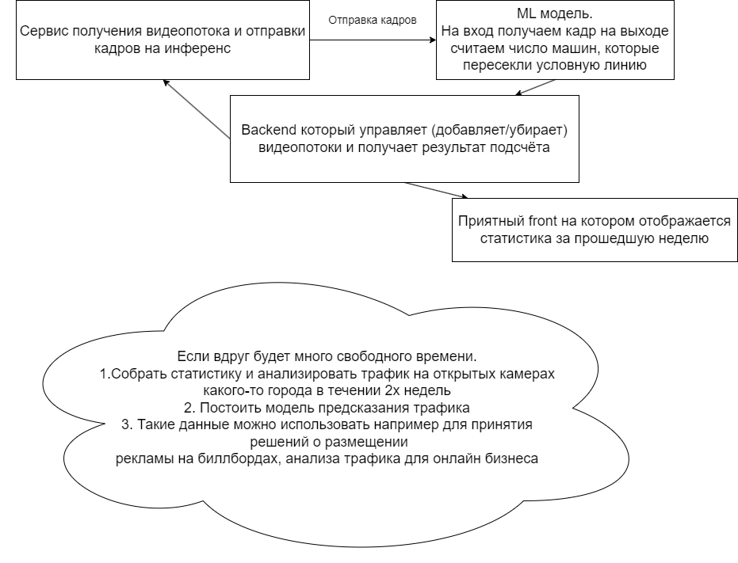

# Traffic counting
This project was created to track traffic on the roads. 
With it, you can analyze and predict traffic jams, as well 
as build optimal routes. The project has a built-in ability
to detect cars and count cars that have passed
the road per unit of time

The limit for the processed video stream is currently
60 frames per second (60 FPS)

To scale the project, it is proposed to organize 
a kubercluster for the adaptive launch of the required
number of containers with the application

Business metric. The base metric is the % conversion from the stream.
Permissible error in conversion calculation is not higher than 10%

# Demo:

## Component Diagram

# How to use:

## Before run
- add coord of track zone in demo/sample/cam_04.json at the points field
- add coord of direction vector in the label: directions field
- to easy get coord from your image use the interactive_image.py
- download yolo weights from https://drive.google.com/file/d/10It3-bByVQUiLV9q4sdJDXQ3bNK9obKi/view?usp=sharing
## To run 
`python run.py --input_path=<>  --output_path=<> --weight=<weights path>`

Note: name of input file must be: cam_04.mp4

## How to run web app
Run `python app.py` and then go to `http://127.0.0.1:5003` in your web browser  
*!!! Tested on chromium-based browsers*

## To run container on local machine
`docker run -dit -p 5003:5003 germanleontiev/traffic_counting`

# Experiments:

The yolov8 model was trained with different training parameters

## Results:

| Optimizer |  Learning Rate  | Box Loss | Cls Loss | Dfl_loss |
| :---:   | :---: | :---: | :---: | :---: |
| Adam | 0.001 | 0.54148 | 0.49476 | 0.97529 |
| Adam | 0.01 | 0.53688 | 0.48114 | 0.97096 |
| Adam | 0.1 | 0.54302 | 0.4469 | 0.9662 |
| RMSProp | 0.001 | 0.54516 | 0.47751 | 0.98843 |
| RMSProp | 0.01 | 0.54908 | 0.48331 | 0.98594 |
| RMSProp | 0.1 | 0.54254 | 0.47167 | 0.9744 |
| SGD | 0.001 | 0.53897 | 0.44084 | 0.96548 |
| SGD | 0.01 | 0.53944 | 0.44993 | 0.95431 |
| SGD | 0.1 | 0.55186 | 0.46054 | 0.94533 |

### project authors German, Julia, Dmitry

