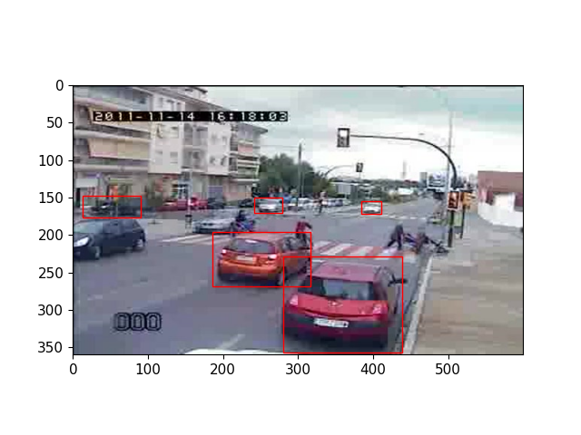

# Обучение модели детектирования

Была обучена модель yolov8

Веса находятся в файле `best.pt`
Результаты обучения в файле `results.csv`

Процесс подготовки данных и обучение в ноутбуке `data_preparation_and_train.ipynb`
Запуск модели `inference.ipynb`

Результат:
(`preds.png`)

## Эксперименты:

| Optimizer |  Learning Rate  | Box Loss | Cls Loss | Dfl_loss |
| :---:   | :---: | :---: | :---: | :---: |
| Adam | 0.001 | 0.54148 | 0.49476 | 0.97529 |
| Adam | 0.01 | 0.53688 | 0.48114 | 0.97096 |
| Adam | 0.1 | 0.54302 | 0.4469 | 0.9662 |
| RMSProp | 0.001 | 0.54516 | 0.47751 | 0.98843 |
| RMSProp | 0.01 | 0.54908 | 0.48331 | 0.98594 |
| RMSProp | 0.1 | 0.54254 | 0.47167 | 0.9744 |
| SGD | 0.001 | 0.53897 | 0.44084 | 0.96548 |
| SGD | 0.01 | 0.53944 | 0.44993 | 0.95431 |
| SGD | 0.1 | 0.55186 | 0.46054 | 0.94533 |
